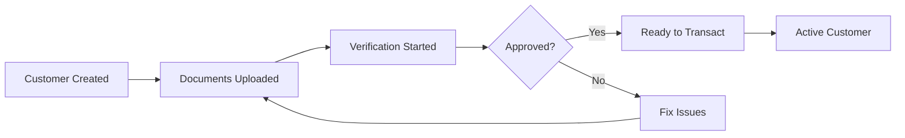

A **customer** represents a user of your business who wants to buy, sell, or transfer digital money (stablecoins). Think of customers as the people or businesses using your product or service.

Our APIs allow you to register your end users with Lumx, enabling seamless and compliant movement of stablecoins or fiat between your users’ wallets or bank accounts.

Lumx handles all **KYC (Know Your Customer)** and **KYB (Know Your Business)** verification steps, so you have confidence that your users meet all applicable compliance requirements.

---

### Customer Registration

To register a new customer, use either the API or KYC Links. Upon registration:

- Customers must **agree to Lumx's Terms of Service**.
- You must provide **basic identity information** such as:
  - Full name
  - Email address
  - Government-issued identifiers (e.g., SSN for individuals, EIN/TIN for businesses)

Lumx will validate this information to approve the customer for transactions. If additional information is needed, Lumx will return precise requirements for completion of the KYC/KYB process.

📘**See Also**: [**Compliance Requirements**](/compliance/compliance-requirements) for a detailed list of required fields and document types.

---

Lumx automatically generates a unique **wallet**  for every customer created and verified. Think of it like a digital account that can:

- **Hold** digital money (stablecoins)
- **Receive** funds from other wallets or bank transfers
- **Send** money to other customers or external wallets
- **Show balance** in real-time

Check our guides to follow a step-by-step process to create your first customer.

## Customer Verification (KYC/KYB)

Before customers can move money, they need to be verified. This is like opening a bank account - we need to confirm who they are.

### Verification Process

<Steps>
  <Step title="Create Customer">
    Add basic customer information via API
  </Step>
  <Step title="Upload Documents">
    Customer provides ID and proof of address
  </Step>
  <Step title="Review">
    Documents are reviewed (usually within minutes)
  </Step>
  <Step title="Approval">
    Once approved, the customer can start transacting
  </Step>
</Steps>

## Customer Lifecycle

## Common Questions

<AccordionGroup>
  <Accordion title="Can customers have multiple wallets?">
    No, each customer has one wallet that can hold multiple currencies (USDC and USDT).
  </Accordion>
  <Accordion title="What happens if verification fails?">
    Customers can re-submit corrected documents. Common issues include blurry photos or expired documents.
  </Accordion>
  <Accordion title="Can customers use the platform without verification?">
    Customers can be created without verification, but they cannot perform transactions until verified.
  </Accordion>
  <Accordion title="How long does verification take?">
    Individual verification usually takes minutes. Business verification can take up to 24 hours.
  </Accordion>
</AccordionGroup>

## Next Steps

Now that you understand customers and wallets:

<CardGroup cols={2}>
  <Card title="Learn About Exchange Rates" icon="chart-line" href="/concepts/exchange-rates">
    How currency conversion pricing works
  </Card>
  <Card title="Understand Transactions" icon="arrows-rotate" href="/concepts/transactions">
    How money moves in the system
  </Card>
</CardGroup>