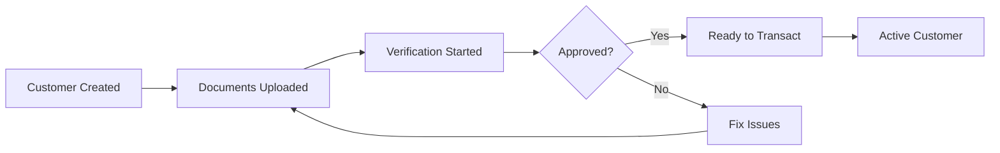

## What is a Customer?

A **customer** represents a user of your business who wants to buy, sell, or transfer digital money (stablecoins). Think of customers as the people or businesses using your application.

When someone signs up for your service, you create a customer profile for them in Lumx. This gives them:
- A unique identity in the system
- An automatic crypto wallet to hold their funds
- The ability to convert money between traditional (BRL) and digital (USDC/USDT) formats

## Customer Types

### Individual Customers
Regular people using your service for personal transactions.

**What they need:**
- Full name
- Tax ID (CPF in Brazil)
- Birth date
- Email address
- Country

**Example:** Maria wants to send money to her family abroad using your app.

### Business Customers
Companies using your service for business operations.

**What they need:**
- Legal company name
- Business tax ID (CNPJ in Brazil)
- Incorporation date
- Email address
- Country
- List of owners (beneficiaries with 20%+ ownership)

**Example:** A startup wants to pay international suppliers using stablecoins.

## How Wallets Work

Every customer automatically gets a **crypto wallet** when they're created. Think of it like a digital bank account that can:

- **Hold** digital money (USDC and USDT stablecoins)
- **Receive** funds from other wallets or bank transfers
- **Send** money to other customers or external wallets
- **Show balance** in real-time

### Key Points About Wallets

<CardGroup cols={2}>
  <Card title="Automatic Creation" icon="wand-magic-sparkles">
    No setup needed - wallets are created instantly with each customer
  </Card>
  <Card title="Multi-Currency" icon="coins">
    Each wallet can hold both USDC and USDT stablecoins
  </Card>
  <Card title="Blockchain Based" icon="cube">
    Built on Polygon blockchain for fast, secure transactions
  </Card>
  <Card title="No Keys Required" icon="key">
    Lumx manages the technical complexity - no private keys to worry about
  </Card>
</CardGroup>

## Customer Verification (KYC/KYB)

Before customers can move money, they need to be verified. This is like opening a bank account - we need to confirm who they are.

### Verification Process

<Steps>
  <Step title="Create Customer">
    Add basic customer information via API
  </Step>
  <Step title="Upload Documents">
    Customer provides ID and proof of address
  </Step>
  <Step title="Review">
    Documents are reviewed (usually within minutes)
  </Step>
  <Step title="Approval">
    Once approved, customer can start transacting
  </Step>
</Steps>

### Required Documents

**For Individuals:**
- Government ID (passport, driver's license, or national ID)
- Proof of address (utility bill, bank statement)

**For Businesses:**
- Company registration documents
- Proof of business address
- Documents for each owner (20%+ ownership)

## Transaction Limits

Once verified, customers have daily and monthly limits for safety:

| Customer Type | Per Transaction | Daily Limit | Monthly Limit |
|--------------|-----------------|-------------|---------------|
| Individual | $1,000 | $10,000 | $100,000 |
| Business | $10,000 | $100,000 | $1,000,000 |

<Note>
  Higher limits may be available for enterprise customers. Contact support for more information.
</Note>

## Customer Lifecycle

## Common Questions

<AccordionGroup>
  <Accordion title="Can customers have multiple wallets?">
    No, each customer has one wallet that can hold multiple currencies (USDC and USDT).
  </Accordion>
  
  <Accordion title="What happens if verification fails?">
    Customers can re-submit corrected documents. Common issues include blurry photos or expired documents.
  </Accordion>
  
  <Accordion title="Can customers use the platform without verification?">
    Customers can be created without verification, but they cannot perform transactions until verified.
  </Accordion>
  
  <Accordion title="How long does verification take?">
    Individual verification usually takes minutes. Business verification can take up to 24 hours.
  </Accordion>
</AccordionGroup>

## Next Steps

Now that you understand customers and wallets:

<CardGroup cols={2}>
  <Card 
    title="Learn About Exchange Rates" 
    icon="chart-line" 
    href="/concepts/exchange-rates"
  >
    How currency conversion pricing works
  </Card>
  <Card 
    title="Understand Transactions" 
    icon="arrows-rotate" 
    href="/concepts/transactions"
  >
    How money moves in the system
  </Card>
</CardGroup>