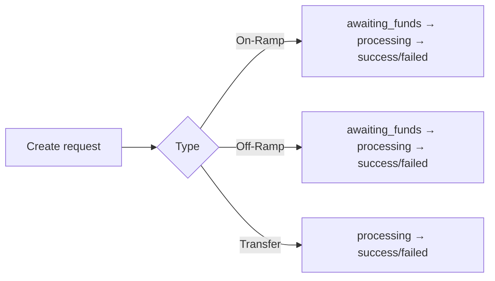

## Overview

A **transaction** is how value moves through Lumx. There are three types:

- **On-Ramp** — convert **fiat** to a \*\*stablecoin \*\*and deliver it to a wallet.
- **Off-Ramp** — convert a **stablecoin** to **fiat** and pay it out via a rail.
- **Transfer** — move a **stablecoin** between customers or to an external wallet.

Use any supported fiat, asset, network, and rail configured for your account. See [**Coverage**](/get-started/coverage).

---

## Transaction anatomy

Every transaction returns a consistent envelope with type-specific details.

```json
{
  "id": "uuid",
  "customerId": "uuid",
  "type": "on_ramp | off_ramp | transfer",
  "request": { /* input params for this transaction */ },
  "state": {
    "status": "awaiting_funds | processing | success | failed",
    "payment": { /* rail-specific fields, e.g., brCode for Pix */ },
    "receipt": { /* rate, amounts, fees (after settlement) */ },
    "blockchain": { "transactionHash": "...", "blockExplorerUrl": "..." },
    "error": { /* optional error object */ }
  },
  "createdAt": "ISO-8601",
  "updatedAt": "ISO-8601"
}
```

<Info>
  Field presence is **status-dependent** and varies by type. See the type guides for full examples.
</Info>

---

## Statuses by type

### On-Ramp

- `awaiting_funds` — waiting for the customer’s deposit on the selected payment rail (`state.payment.*`).
- `processing` — deposit confirmed; conversion and delivery in progress.
- `success` — stablecoin delivered; `state.receipt.*` and, when applicable, `state.blockchain.*`.
- `failed` — transaction failed/expired; see `state.error` if present.

### Off-Ramp

- `awaiting_funds` — waiting for on-chain funding of the source stablecoin.
- `processing` — funding confirmed; conversion and fiat payout in progress.
- `success` — fiat settled on the selected payment rail; `state.receipt.*`.
- `failed` — transaction failed/expired; see `state.error`.

### Transfer

- `processing` — on-chain submission/confirmation in progress.
- `success` — transfer confirmed on-chain; `state.blockchain.transactionHash` and `blockExplorerUrl`.
- `failed` — transfer failed (e.g., insufficient funds, invalid address, network error); see `state.error`.

---

## Lifecycles (at a glance)



- **On-Ramp:** create → deposit instructions → customer funds fiat → deliver stablecoin.
- **Off-Ramp:** create → provide payout details → customer funds stablecoin → pay out fiat.
- **Transfer:** create → on-chain transfer → confirm.

---

## Exchange rates & amounts

Transactions may use **floating** or **locked** exchange rates:

- **Floating** — priced at **execution**; simpler UX; no lock premium.
- **Locked** — **guaranteed** for a short window; comes with an `exchangeRateId` and `expiresAt`; may include a **lock premium** that depends on lock duration and market conditions.

See: [**Floating Exchange Rate**](/guides/floating-exchange-rate) • [**Locked Exchange Rate**](/guides/locked-exchange-rate).

---

## Fees (concepts)

Both transaction and rate responses show transparent fees:

- **Lumx fees** — percentage (bps) and/or flat, in a defined currency.
- **Partner fees** — optional via `partnerFeeId`.

Final delivered amounts are reflected in `state.receipt.*` on `success`.

---

## Retries

Safe to **poll** by transaction ID and/or subscribe to **webhooks** for status changes. See [**Webhooks**](/get-started/webhooks).

---

## Common errors

- **Rates**: `rate_expired`, `invalid_exchangeRateId`, `unsupported_pair`, `amount_out_of_range`.
- **Payments/Funding**: `payment_expired`, insufficient balance/funding not received.
- **Delivery/Payout**: invalid delivery address/payout fields, rail constraints.
- **Transfers**: invalid address format, insufficient funds, network errors.

Handle errors by showing clear UI, offering **retry** (new quote or new payment), and preventing duplicate submissions (idempotency).

---

## Best practices

- **Pick the simplest pricing**: use **floating** unless your UI or workflow needs a guaranteed amount.
- **Short locks** (if using locked): keep `timeLock` minimal to reduce premium and expiry risk.
- **Show timers** where relevant (payment window, lock countdown).
- **Validate early**: wallet addresses, payout fields, balances, and limits.
- **Observe limits & compliance**: KYC/KYB, sanctions/KYT, AML alerts.

---

## Related resources

- **Concepts:** [Exchange Rates](/concepts/exchange-rates) • [Partner Fees](/concepts/partner-fees) • [Coverage](/get-started/coverage)
- **API Reference:** [On-Ramp](/api-reference/transactions/on-ramp) • [Off-Ramp](/api-reference/transactions/off-ramp) • [Transfer](/api-reference/transactions/transfer)