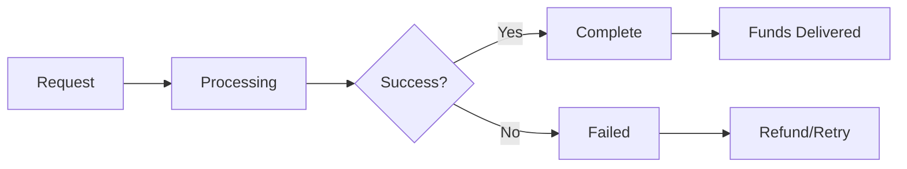

## What are Transactions?

Transactions are how money moves in Lumx. There are three main types:

1. **On-Ramp** - Converting regular money (BRL) into digital money (USDC/USDT)
2. **Off-Ramp** - Converting digital money back to regular money
3. **Transfer** - Sending digital money between wallets

Think of it like this:
- **On-ramp** = Depositing cash into the digital world
- **Off-ramp** = Withdrawing digital money as cash
- **Transfer** = Sending digital money to someone else

## On-Ramp: Fiat to Crypto

When your customer wants to buy stablecoins with Brazilian Reais.

### How It Works

<Steps>
  <Step title="Customer Requests">
    Customer wants to convert R$1,000 to USDC
  </Step>
  <Step title="Get PIX Code">
    System generates a PIX QR code for payment
  </Step>
  <Step title="Customer Pays">
    Customer scans and pays via their bank app
  </Step>
  <Step title="Receive Stablecoins">
    USDC appears in customer's wallet (usually within minutes)
  </Step>
</Steps>

### Real Example

Maria wants to buy $100 worth of USDC:
1. She requests to convert ~R$600 (depending on exchange rate)
2. Gets a PIX QR code to pay
3. Pays using her bank app
4. Receives USDC in her Lumx wallet

### Transaction States

| Status | What It Means | What Customer Sees |
|--------|---------------|-------------------|
| `awaiting_funds` | Waiting for PIX payment | "Please complete your payment" |
| `processing` | Payment received, converting | "Processing your purchase..." |
| `success` | Complete! | "USDC added to your wallet" |
| `failed` | Something went wrong | "Transaction failed - refund initiated" |

## Off-Ramp: Crypto to Fiat

When your customer wants to convert their stablecoins back to Brazilian Reais.

### How It Works

<Steps>
  <Step title="Customer Requests">
    Customer wants to convert 100 USDC to BRL
  </Step>
  <Step title="Provide PIX Key">
    Customer enters their PIX key (CPF, email, phone, etc.)
  </Step>
  <Step title="Confirm Transaction">
    System deducts USDC from wallet
  </Step>
  <Step title="Receive Money">
    BRL arrives in customer's bank account via PIX
  </Step>
</Steps>

### Real Example

João wants to cash out 100 USDC:
1. He requests to convert 100 USDC to BRL
2. Enters his PIX key (CPF: 123.456.789-00)
3. USDC is deducted from his wallet
4. Receives ~R$600 in his bank account

### PIX Key Types Supported

| Type | Example | Description |
|------|---------|-------------|
| CPF | `123.456.789-00` | Individual tax ID |
| CNPJ | `12.345.678/0001-00` | Business tax ID |
| Email | `user@example.com` | Email address |
| Phone | `+5511999999999` | Phone number |
| Random | `123e4567-e89b-12d3...` | Random key (EVP) |

## Transfer: Wallet to Wallet

Moving stablecoins between Lumx customers or to external wallets.

### How It Works

<Steps>
  <Step title="Choose Recipient">
    Select another Lumx customer or enter a wallet address
  </Step>
  <Step title="Enter Amount">
    Specify how much USDC or USDT to send
  </Step>
  <Step title="Confirm">
    Review and confirm the transfer
  </Step>
  <Step title="Instant Delivery">
    Funds arrive instantly in recipient's wallet
  </Step>
</Steps>

### Transfer Types

<CardGroup cols={2}>
  <Card title="To Lumx Customer" icon="user">
    Send to another user in your platform using their customer ID
  </Card>
  <Card title="To External Wallet" icon="wallet">
    Send to any blockchain wallet address (like 0x123...)
  </Card>
</CardGroup>

## Transaction Lifecycle

All transactions follow a similar pattern:



## Understanding Fees

Every transaction may include fees:

- **Lumx Fee**: Platform fee for processing
- **Partner Fee**: Optional fee you can add for your revenue
- **Network Fee**: Blockchain gas fees (covered by Lumx)

### Fee Example

```
Customer wants to buy 100 USDC with BRL

Base amount: 100 USDC
Lumx fee (1%): -1 USDC
Partner fee (0.5%): -0.5 USDC
-------------------
Customer receives: 98.5 USDC
```

## Settlement Times

How fast transactions complete:

| Transaction Type | Typical Time | Maximum Time |
|-----------------|--------------|--------------|
| On-Ramp (PIX) | 1-5 minutes | 30 minutes |
| Off-Ramp (PIX) | 1-5 minutes | 30 minutes |
| Transfer | Instant | 2 minutes |

<Note>
  PIX operates 24/7, so transactions work any time, including weekends and holidays.
</Note>

## Common Scenarios

### E-commerce Payment
1. Customer buys a product for 100 USDC
2. Transfer from customer wallet to merchant wallet
3. Merchant can keep USDC or off-ramp to BRL

### International Remittance
1. Customer in Brazil on-ramps BRL to USDC
2. Transfers USDC to family member's wallet
3. Family member off-ramps to their local currency

### Salary Payment
1. Company on-ramps payroll amount to USDC
2. Batch transfers to employee wallets
3. Employees off-ramp as needed

## Transaction Safety

<Info>
  All transactions are:
  - **Recorded on blockchain** - Permanent, transparent record
  - **Non-reversible** - Once complete, cannot be undone
  - **KYC verified** - Only verified customers can transact
  - **Monitored** - Automatic fraud and AML checks
</Info>

## Transaction Best Practices

### On-Ramp Transactions
- Display clear payment countdown timers
- Provide both QR code and copy-paste PIX options
- Implement webhook listeners for real-time updates
- Handle expired transactions gracefully

### Off-Ramp Transactions
- Validate PIX key format before submission
- Confirm recipient details clearly
- Check balance before initiating
- Implement proper error handling

### Transfer Transactions
- Validate wallet addresses (0x + 40 hex characters)
- Check sender balance before transfer
- Implement transfer limits and velocity checks
- Log all transfer attempts for security

## Compliance and Security

### Transaction Monitoring
All transactions are subject to:
- Anti-money laundering (AML) checks
- Sanctions screening for external addresses
- Reporting requirements for large amounts
- Travel Rule compliance for cross-border transfers

### PIX Payment Considerations
- PIX payments have time limits (typically 30 minutes)
- Transfers to PIX keys are irreversible once processed
- Always verify PIX key ownership before off-ramp

### Error Handling

Common transaction errors and solutions:

| Error | Cause | Solution |
|-------|-------|----------|
| Insufficient Balance | Not enough funds | Check balance before transaction |
| Invalid Address | Malformed wallet address | Validate format client-side |
| Transaction Expired | Payment time limit exceeded | Create new transaction |
| Limit Exceeded | Over daily/monthly limit | Split transaction or wait |

## Common Questions

<AccordionGroup>
  <Accordion title="Can transactions be cancelled?">
    On-ramp can be cancelled before payment. Off-ramp and transfers cannot be cancelled once initiated.
  </Accordion>
  
  <Accordion title="What happens if a transaction fails?">
    For on-ramps, money is refunded. For off-ramps, USDC returns to wallet. Transfers rarely fail but would return to sender.
  </Accordion>
  
  <Accordion title="Are there transaction limits?">
    Yes, based on customer verification level. Standard limits are $1,000 per transaction, $10,000 daily.
  </Accordion>
  
  <Accordion title="How are exchange rates determined?">
    Rates update in real-time based on market conditions. You can lock a rate for certainty or use floating rates.
  </Accordion>
</AccordionGroup>

## Next Steps

Ready to start building?

<CardGroup cols={3}>
  <Card 
    title="Customer Setup" 
    icon="user-plus" 
    href="/guides/individual-onboarding"
  >
    Create and verify customers
  </Card>
  <Card 
    title="Process Payments" 
    icon="money-bill-transfer" 
    href="/guides/on-ramp-transactions"
  >
    Accept fiat payments
  </Card>
  <Card 
    title="Send Money" 
    icon="paper-plane" 
    href="/guides/transfer-transactions"
  >
    Transfer between wallets
  </Card>
</CardGroup>